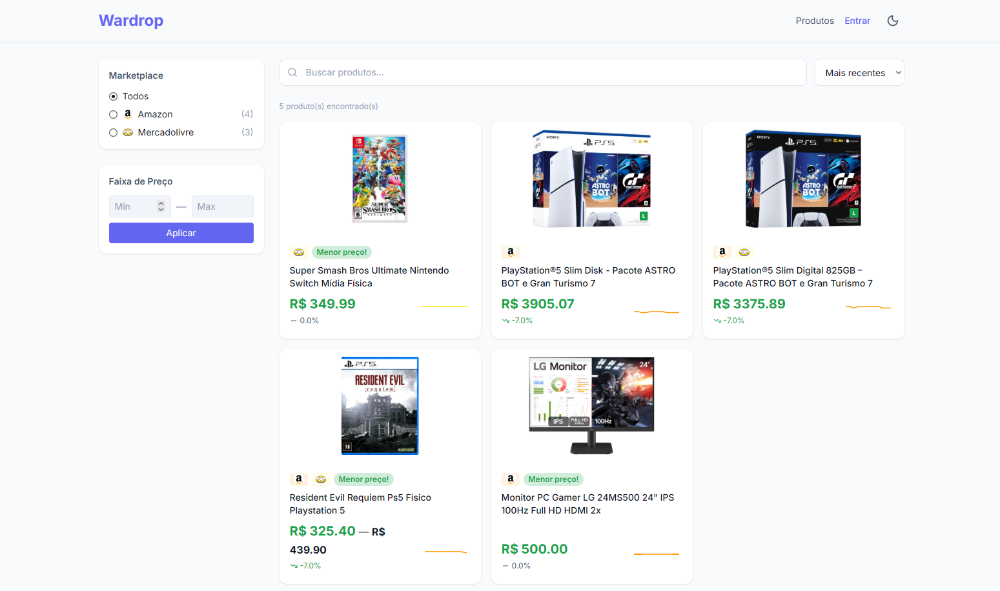
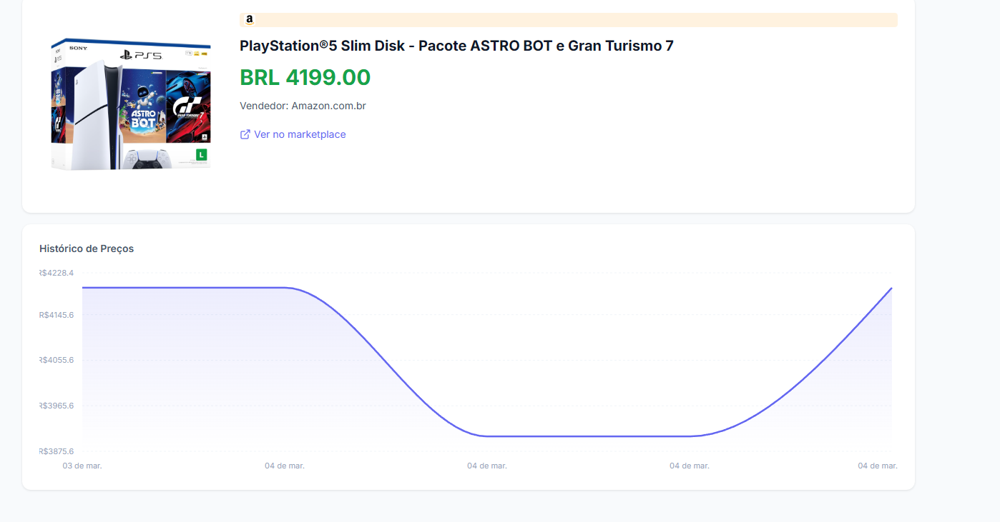
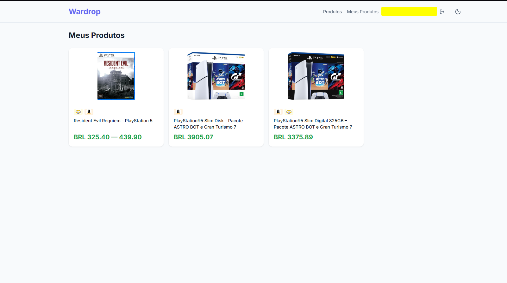
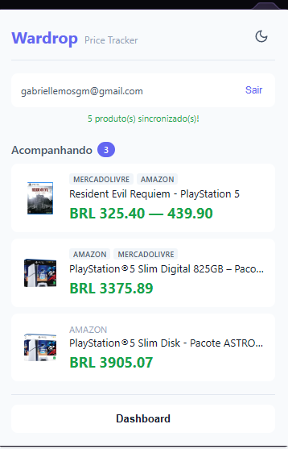
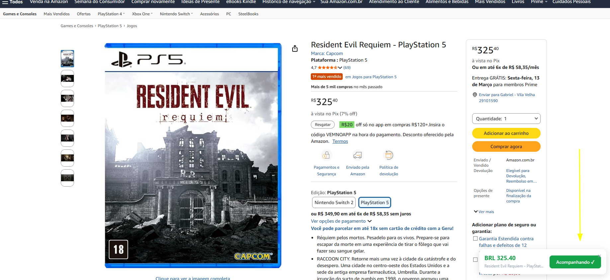

<p align="center">
  
</p>

<h1 align="center">Wardrop</h1>

<p align="center">
  <strong>Cross-marketplace price tracker for Brazilian e-commerce</strong><br/>
  Track products across Amazon, Mercado Livre, Magalu, Shopee, and more — all in one place.
</p>

<p align="center">
  
  
  
  
</p>

---

## Overview

Wardrop is a full-stack price tracking system that monitors product prices across major Brazilian marketplaces. It consists of three components that work together:

- **Chrome Extension** — Detects products on marketplace pages, lets you track them with one click, and shows price history in a popup.
- **Web Dashboard** — Browse all tracked products, filter by marketplace, compare prices across stores, and view detailed price history charts.
- **Backend API** — Scrapes prices automatically on a schedule, groups identical products from different marketplaces, and uses LLM-powered extraction for accurate data.

### Supported Marketplaces

Amazon | Mercado Livre | Magazine Luiza | Shopee | Casas Bahia | Americanas | Kabum | AliExpress

## Screenshots

### Web Dashboard

<p align="center">
  
</p>

### Product Detail & Price History

<p align="center">
  
</p>

### My Products (Logged In)

<p align="center">
  
</p>

### Chrome Extension Popup

<p align="center">
  
</p>

### One-Click Tracking on Marketplace Pages

<p align="center">
  
</p>

## Architecture

```
┌─────────────────┐     ┌─────────────────┐     ┌─────────────────┐
│  Chrome Extension│     │   Next.js Web   │     │  FastAPI Backend │
│  (Vanilla JS)   │────▶│  (TypeScript)   │────▶│  (Python 3.12)  │
│                 │     │  localhost:3000  │     │  localhost:8000  │
└─────────────────┘     └─────────────────┘     └────────┬────────┘
                                                         │
                                              ┌──────────▼──────────┐
                                              │    PostgreSQL 16    │
                                              │   (Docker/Native)   │
                                              └─────────────────────┘
```

### Key Features

- **LLM-powered extraction** — Uses Groq (configurable) to parse product data from any marketplace HTML, with schema.org as a free first layer.
- **Smart product grouping** — Automatically detects the same product across different marketplaces using LLM-based similarity matching.
- **Scheduled scraping** — Tracked products are scraped every hour; untracked every 24 hours.
- **Hybrid extension** — Works offline with local storage, syncs to cloud when logged in.
- **Bidirectional auth sync** — Login/logout state syncs instantly between the web app and extension.
- **Pix price priority** — Always captures the lowest available price (Pix/à vista discount).
- **Dark mode** — Full dark/light theme support across web and extension.

## Getting Started

### Prerequisites

- [Docker](https://docs.docker.com/get-docker/) & Docker Compose
- [Node.js](https://nodejs.org/) 18+
- Python 3.12+
- A Groq API key (or other LLM provider)

### 1. Clone & configure

```bash
git clone https://github.com/GALI3600/Wardrop-V2.git
cd Wardrop-V2
cp backend/.env.example backend/.env
# Edit backend/.env with your Groq API key
```

### 2. Start with Docker Compose

```bash
docker compose up -d
```

This starts PostgreSQL, the FastAPI backend (`:8000`), and the Next.js web app (`:3000`).

### 3. Run database migrations

```bash
make migrate
```

### 4. Load the Chrome extension

1. Open `chrome://extensions` in Chrome
2. Enable **Developer mode**
3. Click **Load unpacked** and select the `extension/` folder

### 5. Open the dashboard

Visit [http://localhost:3000](http://localhost:3000) to see the web dashboard.

## Development

### Available Make commands

| Command | Description |
|---------|-------------|
| `make setup` | Full setup (DB + venv + migrations) |
| `make backend` | Run FastAPI server with hot reload |
| `make web` | Run Next.js dev server |
| `make migrate` | Generate and apply Alembic migrations |
| `make test` | Run backend tests |
| `make test-cov` | Run tests with coverage report |
| `make stop` | Stop all Docker containers |
| `make clean` | Remove venv, cache, and containers |
| `make health` | Check if backend is running |

### Project Structure

```
Wardrop-V2/
├── backend/              # FastAPI + SQLAlchemy + Alembic
│   ├── app/
│   │   ├── models/       # SQLAlchemy models (Product, PriceHistory, User)
│   │   ├── routers/      # API endpoints
│   │   ├── services/     # Scraper, LLM parser, similarity matcher
│   │   └── tasks/        # APScheduler jobs
│   └── alembic/          # Database migrations
├── web/                  # Next.js frontend (TypeScript)
│   ├── src/
│   │   ├── app/          # Pages (products, login, meus-produtos)
│   │   ├── components/   # UI components (ProductCard, PriceChart, etc.)
│   │   ├── lib/          # API client, types, shared config
│   │   └── providers/    # Auth & Theme providers
├── extension/            # Chrome Extension (Manifest V3)
│   ├── src/
│   │   ├── content/      # Content scripts (extractor, UI injection, token sync)
│   │   ├── popup/        # Extension popup UI
│   │   ├── background/   # Service worker
│   │   └── lib/          # API client, auth, storage helpers
└── docker-compose.yml    # PostgreSQL + Backend + Web
```

### Environment Variables

Create `backend/.env` with:

```env
GROQ_API_KEY=your_groq_api_key
WARDROP_SECRET_KEY=your_jwt_secret
```

See `backend/.env.example` for all available options.

## Tech Stack

| Layer | Technology |
|-------|-----------|
| Backend | Python 3.12, FastAPI, SQLAlchemy 2.0, Alembic, APScheduler |
| Frontend | Next.js 14, TypeScript, Tailwind CSS, Recharts, TanStack Query |
| Extension | Vanilla JavaScript, Chrome Extension Manifest V3, Chart.js |
| Database | PostgreSQL 16 |
| LLM | Groq (default), configurable for other providers |
| Scraping | BeautifulSoup, schema.org JSON-LD, LLM fallback |

## License

This project is for personal use. All rights reserved.
